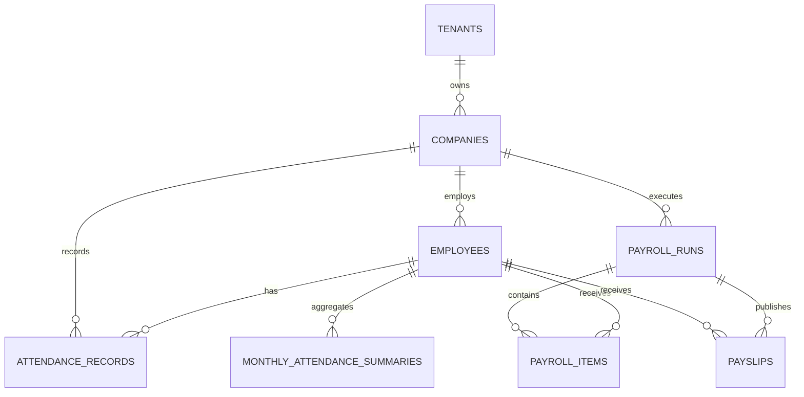

# ERD

## 설계 원칙
- 모든 업무 테이블은 `tenant_id`를 포함한다.
- 회사 소속 업무 데이터는 `company_id`를 포함한다.
- 기본적으로 `created_at`, `updated_at`를 포함한다.
- soft delete가 필요한 엔티티는 `deleted_at`을 포함한다.

## MVP 테이블 초안

### tenants
- id
- name
- created_at
- updated_at

### companies
- id
- tenant_id
- name
- business_registration_number
- representative_name
- policy_config
- created_at
- updated_at
- deleted_at

### employees
- id
- tenant_id
- company_id
- employee_no
- name
- email
- phone
- department
- position
- employment_type
- hire_date
- resignation_date
- status
- created_at
- updated_at
- deleted_at

### attendance_records
- id
- tenant_id
- company_id
- employee_id
- work_date
- clock_in_at
- clock_out_at
- attendance_type
- note
- created_at
- updated_at
- deleted_at

### monthly_attendance_summaries
- id
- tenant_id
- company_id
- employee_id
- year_month
- total_work_minutes
- overtime_minutes
- late_count
- absent_count
- created_at
- updated_at

### payroll_runs
- id
- tenant_id
- company_id
- year_month
- status
- executed_at
- created_at
- updated_at

### payroll_items
- id
- tenant_id
- company_id
- payroll_run_id
- employee_id
- item_type
- item_name
- amount
- created_at
- updated_at

### payslips
- id
- tenant_id
- company_id
- payroll_run_id
- employee_id
- issued_at
- total_earnings
- total_deductions
- net_pay
- created_at
- updated_at

## Mermaid ERD

## Employee API 참조 필드 기준
- `tenant_id`
- `company_id`
- `employee_no`
- `name`
- `email`
- `phone`
- `department`
- `position`
- `employment_type`
- `hire_date`
- `resignation_date`
- `status`
