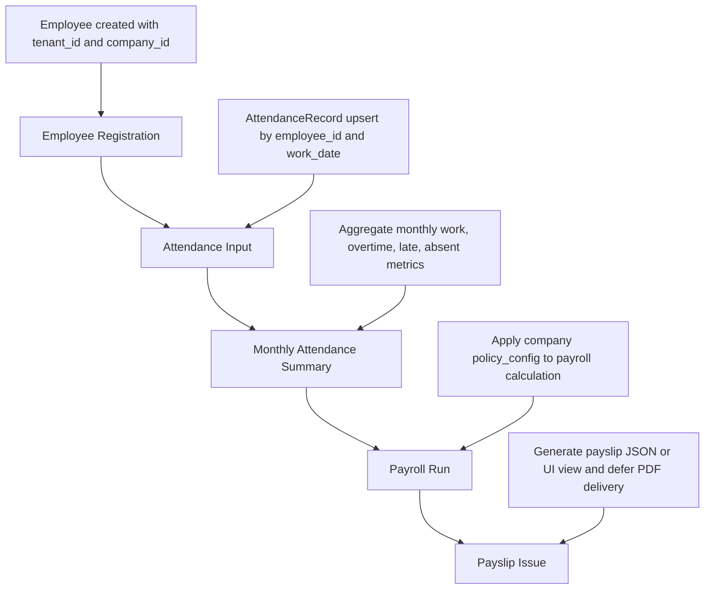

# Workflow Model

## MVP Core Workflow
- 직원 등록
- 근태 입력
- 월 근태 집계
- 급여 생성
- 급여명세서 출력

## Workflow Steps
1. Employee Registration
   - Employee 생성
   - `tenant_id`/`company_id` 기준
2. Attendance Input
   - AttendanceRecord 생성/수정
   - `employee_id`/`work_date` 기준
3. Monthly Attendance Summary
   - AttendanceRecord를 월 단위로 집계
   - MonthlyAttendanceSummary 생성
4. Payroll Run
   - MonthlyAttendanceSummary와 `policy_config` 기반으로 PayrollRun 생성
   - PayrollItem 생성
5. Payslip Issue
   - PayrollItem 기반으로 Payslip 생성
   - MVP에서는 Payslip 조회는 REAL로 구현하고, PDF/이메일/전자문서 발행은 후속 task로 분리

## Admin Workflow
1. Company / Employee 관리
   - `/company`, `/employee`
   - 회사 정보/정책 조회, 직원 등록/수정
2. Attendance Management
   - `/attendance`
   - 전체 직원 근태 조회 및 입력
3. Monthly Attendance Summary
   - `/attendance/monthly-summary`
   - 월 근태 집계 실행
4. Payroll Run
   - `/payroll`
   - 급여 생성 실행
5. Payslip Management
   - `/payslip`
   - 전체 직원 급여명세서 조회

## Employee Self-Service Workflow Candidate
1. Role Switcher에서 Employee 선택
2. `selectedEmployeeId` 선택
3. `/my` 에서 내 정보 조회
4. `/my/attendance` 에서 내 근태 조회
5. `/my/attendance` 에서 내 근태 입력/수정/삭제
6. `/my/payslip` 에서 내 급여명세서 조회

## MVP Role Switcher Rules
- MVP에서는 실제 로그인/인증/JWT를 구현하지 않고 Role Switcher로 admin/employee 역할을 시뮬레이션한다.
- Employee role은 selectedEmployeeId 기준으로 본인 데이터만 조회/입력/수정/삭제한다.
- Employee Self-Service 근태 기능은 별도 /api/me API를 만들지 않고 기존 Attendance API를 재사용한다.
- API-level RBAC, JWT, User/Role DB persistence는 후속 Auth/RBAC task에서 구현한다.
- 삭제는 physical delete가 아니라 deleted_at 기반 soft delete를 원칙으로 한다.

## Mermaid Flow

