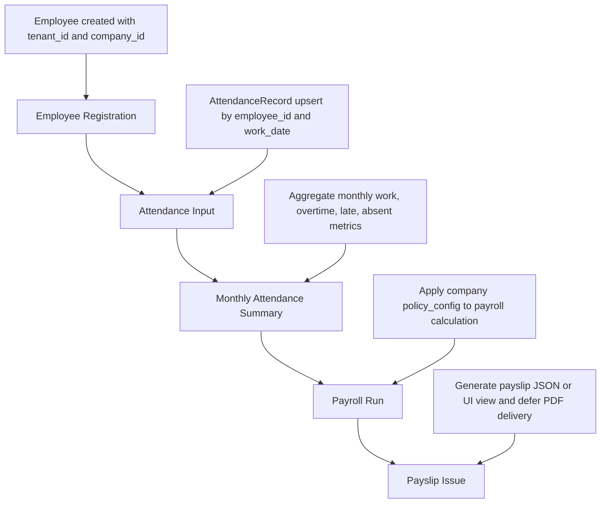

# Workflow Model

## MVP Core Workflow
- 직원 등록
- 근태 입력
- 월 근태 집계
- 급여 생성
- 급여명세서 출력

## Workflow Steps
1. Employee Registration
   - Employee 생성
   - `tenant_id`/`company_id` 기준
2. Attendance Input
   - AttendanceRecord 생성/수정
   - `employee_id`/`work_date` 기준
3. Monthly Attendance Summary
   - AttendanceRecord를 월 단위로 집계
   - MonthlyAttendanceSummary 생성
4. Payroll Run
   - MonthlyAttendanceSummary와 `policy_config` 기반으로 PayrollRun 생성
   - PayrollItem 생성
5. Payslip Issue
   - PayrollItem 기반으로 Payslip 생성
   - MVP에서는 Payslip 조회는 REAL로 구현하고, PDF/이메일/전자문서 발행은 후속 task로 분리

## Mermaid Flow

